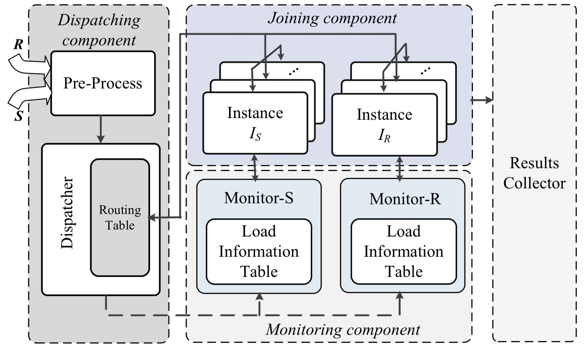

# FastJoin

FastJoin is secondary development based on BiStream(http://www.comp.nus.edu.sg/~linqian/bistream) which is designed based on the join-biclique model.
FastJoin will outperform BiStream when processing skew data. 

## Introdution 

In the bigdata era, many applications are required to perform quick and accurate join operations on large-scale real-time data streams, such as stock trading and online advertisement analysis. To achieve high throughput and low latency, distributed stream join systems explore efficient stream partitioning strategies to execute the complex stream join procedure in parallel. Existing systems mainly deploy two kinds of partitioning strategies, i.e., random partitioning and hash partitioning. Random partitioning strategy partitions one data stream uniformly while broadcasting all the tuples of the other data stream. This simple strategy may incur lots of unnecessary computations for low-selectivity stream join. Hash partitioning strategy maps all the tuples of the two data streams according to their attributes for joining. However, hash partitioning strategy suffers from a serious load imbalance problem caused by the skew distribution of the attributes, which is common in real-world data. The skewed load may seriously affect the system performance. We design a lightweight tuple migration strategy to solve the load imbalance problem in real-time and implement a new distributed stream join system, FastJoin. Experimental results using real-world data show that FastJoin can significantly improve the system performance in terms of throughput and latency compared to the state-of-the-art stream join systems.

## Design of FastJoin

Based on the join-biclique model, we design our skewness-aware distributed stream join system, FastJoin. FastJoin detects the computational workloads of the join instances and perform data migration for dynamic load-balancing in real time. FastJoin consists of three main components and its architecture is depicted in this figure. The first one is a dispatching component which collects input tuples from the two streams, partitions and distributes the tuples to the most suitable join instances. The second one is the joining component which consists of two groups of join processing instances to perform tuple store and join operations. The third is the monitoring component which detects the load imbalance among different join instances and makes migration decisions.

The dispatching component has three units. A pre-processing unit collects the input tuples of both streams and performs some pre-processing operations such as ordering or certain user-defined functions. The pre-processed tuples will be sent to a dispatcher. The dispatcher first partitions tuples according to a data partitioning strategy and then sends each tuple partition to a specific join processing instance. Since we mainly consider how to solve the load imbalance problem for low-selectivity stream join, in this paper we assume the hash partitioning strategy is used, that is, a hash function is performed on each tuple and tuples with the same key are dispatched to the same join instance. After tuples associated with the same keys are migrated from one join instance to another, the dispatcher records the migration information in a routing table. The dispatcher checks the routing table to dispatch the tuples to the right join instances.

The joining component contains a set of join instances which are divided into two groups, each responsible for storing tuples from one stream and performing join operations for the other stream, respectively. For dynamic load balancing each join instance maintains two counters in memory, one counting the number of stored tuples from one stream and the other recording the number of incoming tuples from the other stream for joining. The information will periodically be sent to the monitoring component. When receiving the instruction for data migration from the monitor, the join instance pairs will communicate with each other to send/receive the tuples for load balancing. After that, the instance will notify both the monitor and the dispatcher to update their load information table and routing table accordingly.

There are two monitors in the monitoring component, each being for one group of join instances. The monitors periodi- cally receive the load statistics from the join instances to detect the load imbalance. The load information is stored in a load information table. When the load imbalance occurs, the mon- itor will determine which join instances should offload/upload tuples to/from which join instances and inform those instances for load migration. After the migration, the monitor updates its load information table accordingly.

## Building FastJoin

FastJoin source code is maintained using [Maven](http://maven.apache.org/). Generate the excutable jar by running

    mvn clean package

## Running FastJoin

FastJoin is built on top of [Storm](https://storm.apache.org/). After deploying a Storm cluster, you can launch BiStream by submitting its jar to the cluster. Please refer to Storm documents for how to [set up a Storm cluster](https://storm.apache.org/documentation/Setting-up-a-Storm-cluster.html) and [run topologies on a Storm cluster](https://storm.apache.org/documentation/Running-topologies-on-a-production-cluster.html).
Running 

    storm jar fastjoin-1.0-jar-with-dependencies.jar soj.biclique.KafkaTopology -n 48 --size 30G -t 2.2 -pr 24 -ps 24
(Didi data have to be import before running)

## Publications

If you want to know more detailed information, please refer to this paper:
Shunjie Zhou,Fan Zhang,Hanhua Chen,Hai Jin,Bing Bing Zhou. "FastJoin: A Skewness-Aware Distributed Stream Join System
" in Proceedings of 33rd IEEE International Parallel & Distributed Processing Symposium (IPDPS), 2019.

## Author and Copyright
FastJoin is developed in Cluster and Grid Computing Lab, Services Computing Technology and System Lab, Big Data Technology and System Lab, School of Computer Science and Technology, Huazhong University of Science and Technology, Wuhan, China by Shunjie Zhou(zhoushunjie@hust.edu.cn), Fan Zhang(zhangf@hust.edu.cn), Hanhua Chen (chen@hust.edu.cn), Hai Jin (hjin@hust.edu.cn), Bing Bing Zhou (bing.zhou@sydney.edu.au)

Copyright (C) 2019, STCS & CGCL and Huazhong University of Science and Technology.
